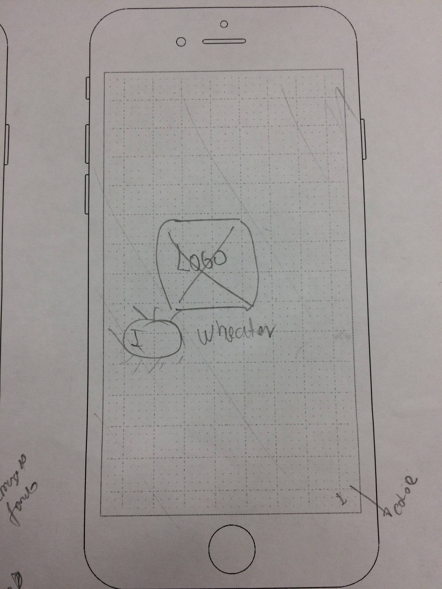
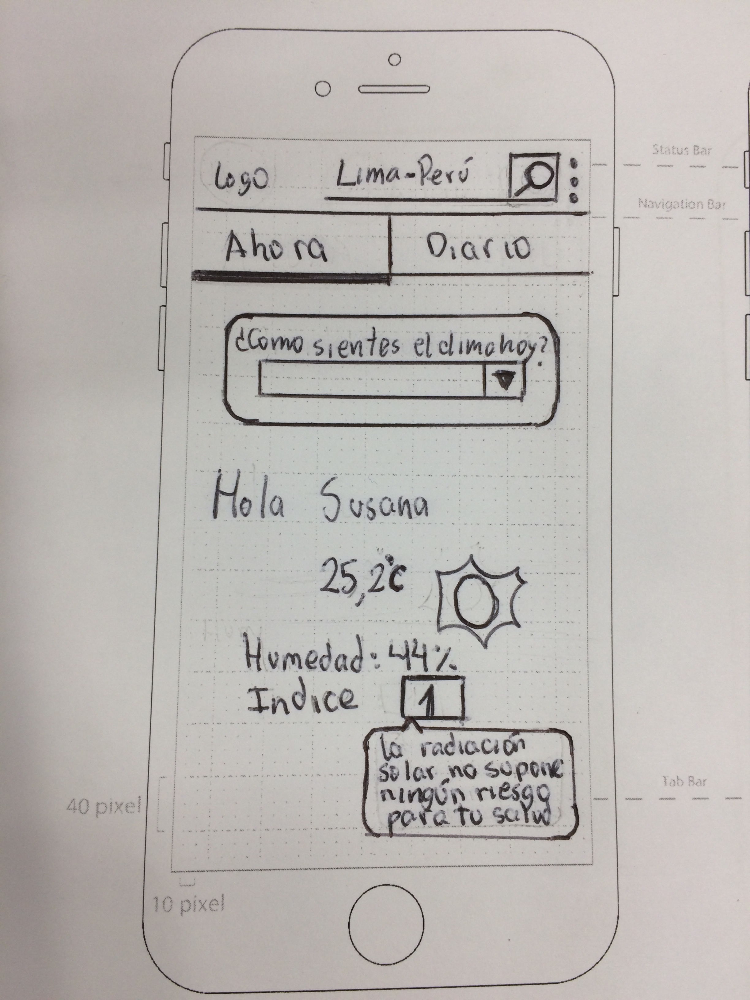
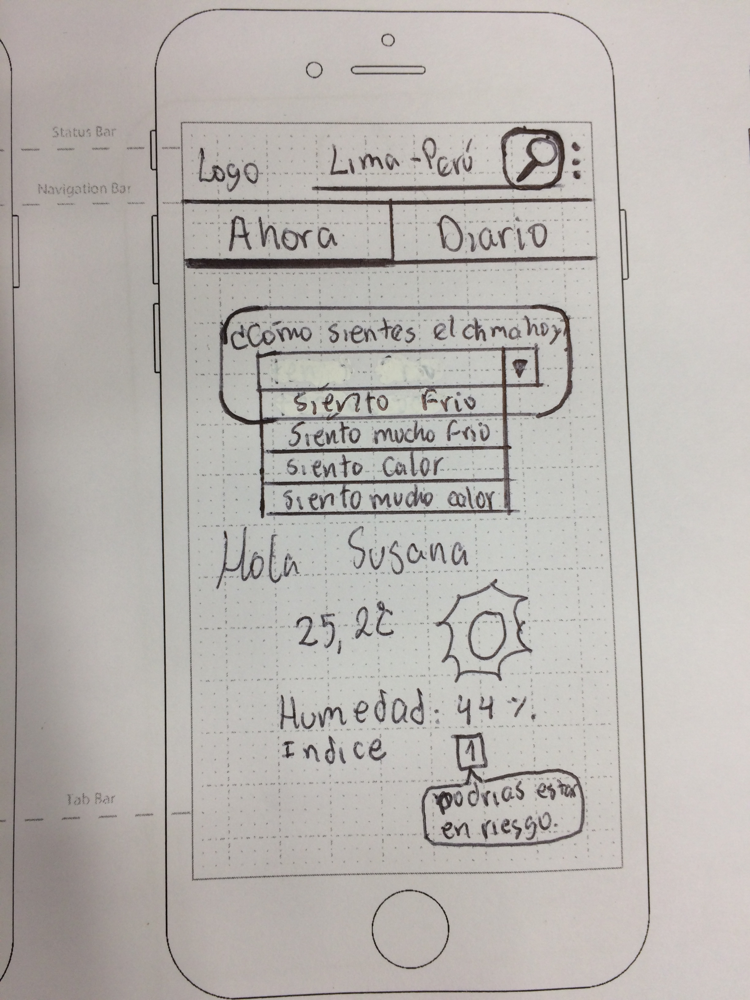
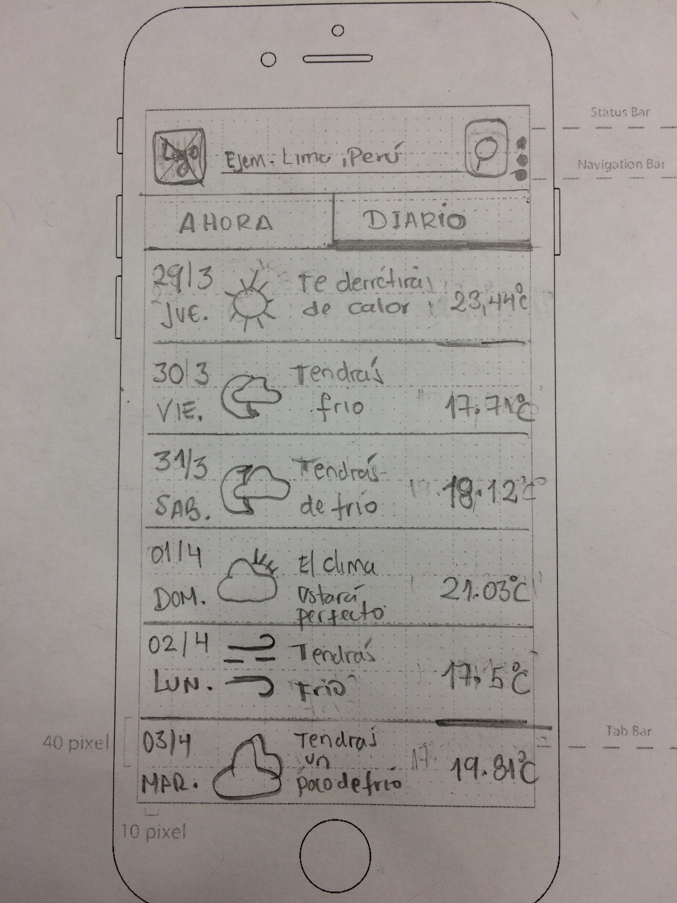
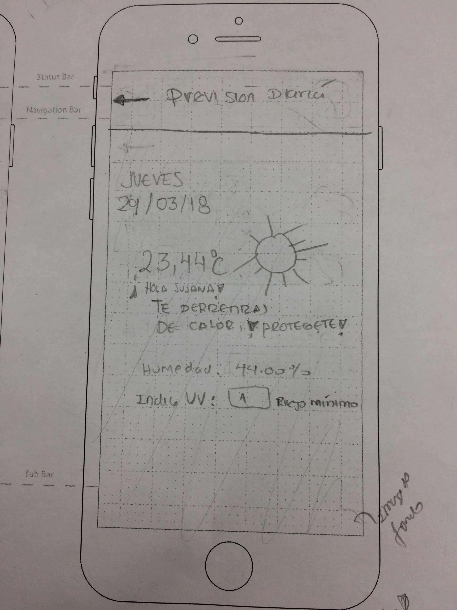

# APP DEL CLIMA: FEELWEATHER

## Reto UX y frontend para Laboratoria

***
## Equipo de trabajo

+ Ortiz Villafuerte, María Cristina.
+ Villalobos, Angélica.
+ Gariboto, Claudia.
+ Otero, Nataly

***
## Descripción
Feelweather es un app que examina las condiciones del clima y las compará com la percepción individual del usuario, almacena dicha información, para luego relacionarlas con el pronóstico y mostrar cómo se sentirá el usuario ese día.

***
## A. Etapa de Diseño de Experiencia de Usuario (UX)

### I. Descubrimiento e Investigación

**Entrevistas personales**

-	Se hizo entrevistas personales para conocer la relación del usuario de la ciudad de Lima con el clima y si le interesaría un app sobre ello.

### Solo nos basamos en tres preguntas básicas

- 1.¿Qué opinas del clima de la ciudad?
- 2.¿Sueles revisar el clima de tu ciudad (temperatura, humedad, etc)?¿Dónde?¿Por qué?
- 3.¿Te gustaría utilizar una app que te avise de que acuerdo a tu percepción del clima, te diga cómo estará el día?¿Cómo te lo imaginarias?

- Usuario 1 (23 años):

   - "No me gusta el verano ni el invierno porque las temperaturas son extremas"
   - "No reviso el clima aquí en Lima, porque no me preocupa"
   - "Una aplicación del clima no me serviría, porque no lo uso..." " Tal vez si viajara o en provincia(sierra) porque ahi en la mañana hace sol y a veces llueve en la tarde".
   - "Que me diga como sentiré tal día no me interesa, más tal vez si me da consejos o recomendaciones personalizadas, pero no usaria una app del clima como te dije".

-  Usuario 2 ( 22 años):

   - "Bueno es variable y predecible."
   - "Realmente no, y si lo hago es porque google me brinda la facilidad para ver y lo hago curiosidad"
   - "Si me gustaría pero creo que no me es tan importante "
-  Usuario 3 ( años):

   - "No me gusta que sea muy húmedo"
   - "Solo cuando estoy de viaje suelo revisar"
   - " Bueno, mi celular tiene eso pero no me avisa, siempre está en la pantalla principal y se actualiza cada vez que tengo internet"

-	Después de realizar tres entrevistas se consideró que el uso de  la herramienta no iba a ser de ayuda porque:

    - Al promedio de usuarios no muestran interés por tener un app del clima, tampoco a un app relacionado a la percepción individual del usuario.

    - Los puntos requeridos en el reto (percepción individual del usuario), no era de interés para el usuario.

**Benchmarking**

- Se elaboró un benchmarking de la apps sobre el clima existente. Esto nos permitió poder ver que estrategias digitales (diseño y funcionalidad) podíamos extraer y adaptarlas a nuestras app.

- Ver benchmarking aquí: https://docs.google.com/spreadsheets/d/1BN2OEfZwCfSR6qPNTuIXQGLki4gyJLtqUfoRHXnC7yI/edit#gid=0

### II. Ideación

- En base a los puntos requeridos en el reto y la información obtenida en el benchmarking se elaboró la lista de componentes y funcionalidades que tendrá la app:

  -  Registro con google.

  -  Una interfaz que muestre la temperatura actual, humedad, índice de radiación deacuerdo a la ubicación actual de usuario; un buscador para mostrar los indicadores mencionados por la ciudad buscada; y un opción para preguntar a la usuario como percibe el clima tal día .

  - Una interfaz que muestre el pronósticos de clima de los últimos 7 días y que deacuerdo a la percepción guardada del usuario relacionado al clima, muestré como se sentirá ese día.

### III. Prototipado: Paper prototipyng (baja fidelidad)

- En base a la lista de componentes y funcionalidades se desarrolló en papel el diseño de la aplicación:

 

 

 

  

   

### IV. Testing del paper protopipyng

-	Se testeó con 2 usuarios las vistas del paper prototipyng

-	Nos permitió entender si la propuesta de diseño era fácil de entender.

  **Usuario 1 (23 años)**

    - "Me parece interesante lo de los rayos UV, ayuda para saber si debería salir en el sol o no..." " podría decirme que precauciones debo tomar deacuerdo al numero que muestran".

    - "Cuando te muestra la frase por día de la semana, debe ir acompañado de alguna recomendación como "tendrás frio, no olvides llevar tu abrigo, come chocolates, que se yo".

    - " En cuestion de diseño se ve bien..."

 **Usuario 2 (25 años)**
 
    - "Me parece chevere que la aplicación quiera o de a entender que se preocupe por mi, sin embargo no creo que realmente pueda cumplir con ello, porque todos sentimos diferente"

    - "Me gusta el flujo, me parece que es muy claro, recomiendo que sea mas personalizado"

### VI. Prototipado: Interfaz de Alta fidelidad (Marvel y Figma)

- Después de testear nuestro prototipo de baja fidelidad y tener el feedback, se desarrolló el  prototipo de alta fidelidad en figma y marvel.

 
 

-  Feelweather:  https://marvelapp.com/87152he/screen/40348837

## B. Etapa de Desarrollo (Frontend)

- Todas los componentes y funcionalidades se desarrollarón usando: React, css, bootstrap, .

## Aprendizajes

- Al desarrollar una aplicación o producto digital los valores agregados no necesariamente cubren una necesidad real del público objetivo.

- Todas las funciones que querramos desarrollar no necesariamente serán factibles de realizar por el equipo de desarrollo(frontend) en un tiempo corto (3 días en este caso).

- Otros valores agregados que se quiere desarrollar más adelante:

  - Deacuerdo a al clima muestre consejos o recomendaciones sobre como cuidarse o que precauciones tomar.

  - Mostrar el clima  cada hora ya que en el día pueden surgir varias variaciones para tomar precauciones, especialmente en ciudades donde el clima suele ser variado (ejm. selva).
